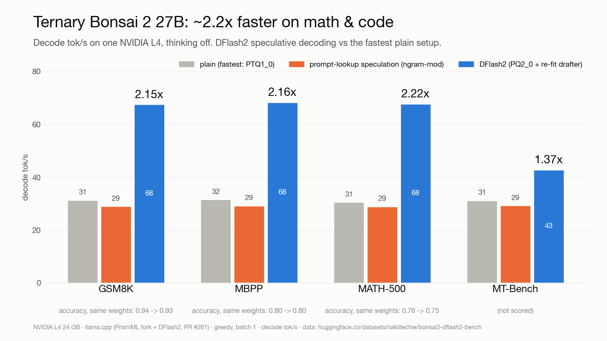

<h1 align="center">bonsai2-run</h1>

<p align="center">
  <strong>Ternary Bonsai 2 27B with DFlash2 speculative decoding on one Google Cloud Run L4 —<br>
  an OpenAI-compatible endpoint that costs nothing while it sits idle.</strong>
</p>

<p align="center">
  One script. Your Google Cloud project. Weights live in your own bucket; nothing but your project sits in the serving path.
</p>

<p align="center">
  <a href="LICENSE"></a>
  
  
  <a href="results/bench-2026-09-24/RESULTS.md"></a>
</p>



## Install

| | |
|---|---|
| **Cloud Shell** (nothing to install) | Open [shell.cloud.google.com](https://shell.cloud.google.com), then `curl -fsSL https://raw.githubusercontent.com/NakliTechie/bonsai2-run/main/cloudrun/bonsai2-cloudrun.sh \| bash` |
| **Any machine with `gcloud`** | Same one-liner, after `gcloud auth login` and `gcloud config set project <id>` |
| **From this repo** (build your own image) | `./deploy.sh build && STAGE_VIA=cloudbuild BUCKET=<b> ./deploy.sh stage && BUCKET=<b> ./deploy.sh deploy` |

The script links your billing account, turns on the APIs, requests one Cloud Run L4 in the first region
that grants it, copies the two GGUFs from Hugging Face into your bucket inside Google Cloud, and deploys
[`ghcr.io/naklitechie/bonsai2-run`](https://github.com/NakliTechie/bonsai2-run/pkgs/container/bonsai2-run). Seven to ten
minutes on a new project (9 min 38 s measured on 2026-09-25); it prints the URL and this call:

```bash
curl -s $URL/v1/chat/completions -H "Authorization: Bearer $(gcloud auth print-identity-token)" \
  -H "Content-Type: application/json" \
  -d '{"messages":[{"role":"user","content":"Write a palindrome check in Python."}],"temperature":0}'
```

Needs a Google Cloud account with billing. A Free Trial account must be **upgraded to paid** first; Google
keeps the unused credit, but GPUs and quota requests are blocked during the trial. `PROFILE=chat` picks the
chat setting; `DOWN=1` deletes the service and bucket.

## Why

You want a real 27B model behind an API for a demo, an agent or a weekend project, and you do not want to pay
for a GPU that sits idle. A rented box bills around the clock; a hosted API is someone else's model and logs.

bonsai2-run is one script around PrismML's llama.cpp. Cloud Run starts the L4 on the first request and removes
it when idle, so the bill is per active hour. The model is PrismML's 2-bit
[Ternary Bonsai 2 27B](https://huggingface.co/prism-ml/Ternary-Bonsai-2-27B-gguf) (7.2 GB), so it fits the
cheapest Cloud Run GPU, with a re-fitted
[DFlash2 drafter](https://huggingface.co/naklitechie/Qwen3.8-27B-DFlash2-ternary-bonsai2) and prompt lookup on top.

**Use [djev-run](https://github.com/taeold/djev-run)** for DiffusionGemma-Jev typed decisions on an RTX PRO 6000:
the recipe this repo copies. **Use [dflash-mlx-bonsai2](https://github.com/NakliTechie/dflash-mlx-bonsai2)** or
**[LocalMind](https://localmind.naklitechie.com)** to run the same model and drafter on a Mac or in the browser, for free.
**Use plain llama.cpp** on your own 24 GB GPU if it is already on all day. **Use a hosted API** if you need
many concurrent users; this is one GPU, one request at a time.

## What it costs

About **$1.42 per active hour** in a Tier-1 region (L4 + 8 vCPU + 32 GiB, instance billing, list price),
**$0 idle**, plus cents a month for 8.3 GB in Cloud Storage. The first request after an idle spell waits
for a GPU instance: in-container startup is 18 s (12 s to stream the weights into memory, 6 s to load),
plus Cloud Run's scheduling and image pull.

## How fast

Decode speedup on one L4, greedy, batch 1, vs the fastest plain setup; both rows measured on the same machine in one session:

| | GSM8K | MBPP | MATH-500 | MT-Bench | code edit |
|---|---|---|---|---|---|
| DFlash2 | 2.17x | 2.17x | 2.20x | 1.39x | 2.46x |
| + prompt lookup (default) | 2.14x | 2.07x | 2.19x | 1.39x | **3.15x** |

Accuracy stays within one or two problems per set. On a live Cloud Run instance a "keep this function, add
type hints" edit ran at 148 tok/s. Open-ended writing gains least; `PROFILE=chat` (draft length 3) gets it to
1.26x. Every number, method and raw row: [results/](results/) and the
[Hugging Face dataset](https://huggingface.co/datasets/naklitechie/bonsai2-dflash2-bench).

## Commands

```bash
./deploy.sh status                    # one JSON line: URL, revision, GPU, weights in the bucket
./deploy.sh build                     # build the image on Cloud Build into your Artifact Registry
STAGE_VIA=cloudbuild ./deploy.sh stage  # copy the GGUFs from Hugging Face into gs://$BUCKET
./deploy.sh deploy                    # Cloud Run: L4, min 0 / max 1, GCS FUSE, /health probe
./deploy.sh bench                     # cold-start + three greedy prompts, tok/s and draft acceptance
./deploy.sh down                      # delete the service (the bucket stays)
```

Every command ends with `verdict=<CODE> next=<command>` and a matching exit code (`SPEC.md` §0), so an
agent can drive it without reading prose.

## Verify it yourself

```bash
python3 scripts/bench.py run $URL out.jsonl --token "$(gcloud auth print-identity-token)"
python3 scripts/score.py sets/ results/bench-2026-09-24 [--extended]
```

`score.py` executes generated code in `docker run --network none` and reports pass@1 next to tok/s, so a
speedup that costs accuracy shows up in the same table. The benchmark ran on AWS L4s (two machines, identical
drafts accepted); the deploy path above ran end to end on Cloud Run in asia-southeast1 on 2026-09-25.

## License

MIT. The image contains llama.cpp (MIT) with PrismML's changes; model weights are under their own licenses.
[Spec](SPEC.md) · [Benchmarks](results/) · [Incidents](infra/aws/INCIDENTS.md) · [DFlash2 PR](https://github.com/PrismML-Eng/llama.cpp/pull/261)
