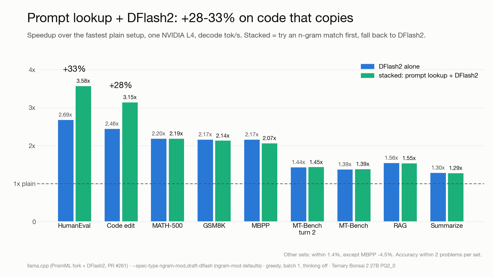

<h1 align="center">bonsai2-run</h1>

<p align="center">
  <strong>Ternary Bonsai 2 27B with DFlash2 speculative decoding on one Google Cloud Run L4 —<br>
  an OpenAI- and Anthropic-compatible endpoint with no GPU bill while it sits idle.</strong>
</p>

<p align="center">
  <a href="LICENSE"></a>
  
  
  <a href="results/bench-stack-2026-09-24/RESULTS.md"></a>
</p>



## Install

**Step 1. Get a Google Cloud account with billing** at [cloud.google.com](https://cloud.google.com). A Free Trial
account must be **upgraded to paid** first: Google keeps the unused credit, but GPUs are blocked during the trial.

**Step 2. Open [Cloud Shell](https://shell.cloud.google.com)** and select or create a project. It is already signed in.

**Step 3. Paste this line.** Wait seven to ten minutes (9 min 38 s measured on a new project).

```bash
curl -fsSL https://raw.githubusercontent.com/NakliTechie/bonsai2-run/main/cloudrun/bonsai2-cloudrun.sh | bash
```

It links billing, turns on the APIs, gets one L4 GPU, copies the model into your own bucket and deploys.

**Step 4. Copy the URL line it prints** and paste it back into the shell:

```text
== Your endpoint is live
  export URL=https://bonsai2-xxxxxxxxxx-as.a.run.app
```

**Step 5. Call it.** The endpoint is private to your Google account. The first call after an idle spell takes
**23 s** (measured) while a GPU starts; later calls answer at once.

```bash
curl -s $URL/v1/chat/completions -H "Authorization: Bearer $(gcloud auth print-identity-token)" \
  -H "Content-Type: application/json" -d '{"messages":[{"role":"user","content":"Write a palindrome check in Python."}]}'
```

## What it costs, and how to stop paying

| While | You pay |
|---|---|
| Someone is calling it | About **$1.42 per hour** the GPU is up (L4 + 8 vCPU + 32 GiB, list price) |
| Nobody is calling it | **$0 for the GPU**, once Cloud Run removes the idle instance (up to 15 min after the last call, billed) |
| Always, until you remove it | About **17 US cents a month** to keep the 8.3 GB model files in your bucket |

The GPU scales to zero; the bill does not, because the model files stay in your bucket for a fast restart.

**To stop all spending**, paste this in Cloud Shell. It deletes the service and the bucket with the model files:

```bash
curl -fsSL https://raw.githubusercontent.com/NakliTechie/bonsai2-run/main/cloudrun/bonsai2-cloudrun.sh | DOWN=1 bash
```

The project then costs $0; to use it again, repeat Step 3. To remove every trace, shut down the project
(Cloud console → **IAM & Admin → Settings**). An alert under **Billing → Budgets & alerts** catches surprises.

## Options

| To | Do (`…` is the Step 3 script URL) |
|---|---|
| Get faster answers (no thinking) | Add `"chat_template_kwargs": {"enable_thinking": false}` to the request body |
| Use the Anthropic Messages API | POST to `$URL/v1/messages` with the same token; `max_tokens` is required |
| Use an OpenAI or Anthropic SDK | Run `gcloud run services proxy bonsai2 --region <region> --port 8080`; base URL `http://localhost:8080/v1` (OpenAI) or `http://localhost:8080` (Anthropic), any API key |
| Tune for chat and prose | `curl -fsSL … \| PROFILE=chat bash` (draft length 3, no prompt lookup) |
| Choose the region | `curl -fsSL … \| REGION=europe-west4 bash` |

## Why

You want a real 27B model behind an API for a demo, an agent or a weekend project, without paying for a GPU that
sits idle. PrismML's 2-bit [Ternary Bonsai 2 27B](https://huggingface.co/prism-ml/Ternary-Bonsai-2-27B-gguf) (7.2 GB) fits the cheapest Cloud Run GPU; a re-fitted
[DFlash2 drafter](https://huggingface.co/naklitechie/Qwen3.8-27B-DFlash2-ternary-bonsai2) and prompt lookup make it about 2.1x faster on math and code, 3.2x on code edits.

**Use [djev-run](https://github.com/taeold/djev-run)** for DiffusionGemma-Jev on an RTX PRO 6000: the recipe this repo
copies. **Use [dflash-mlx-bonsai2](https://github.com/NakliTechie/dflash-mlx-bonsai2)** or **[LocalMind](https://localmind.naklitechie.com)** for the same model on a Mac or in the
browser, free. **Use plain llama.cpp** on your own 24 GB GPU if it is on all day. **Use a hosted API** for many
concurrent users; this is one GPU, one request at a time.

---

## For developers

**How fast.** Decode speedup on one L4, greedy, batch 1, vs the fastest plain setup, same machine and session:

| | GSM8K | MBPP | MATH-500 | MT-Bench | code edit |
|---|---|---|---|---|---|
| DFlash2 | 2.17x | 2.17x | 2.20x | 1.39x | 2.46x |
| + prompt lookup (default) | 2.14x | 2.07x | 2.19x | 1.39x | **3.15x** |

Accuracy stays within one or two problems per set; a live code edit ran at 148 tok/s. Method, raw rows and
`scripts/score.py` (pass@1 next to tok/s): [results/](results/), [HF dataset](https://huggingface.co/datasets/naklitechie/bonsai2-dflash2-bench).

**From your own machine:** `gcloud auth login`, `gcloud config set project <id>`, then Step 3. **Own image:**

```bash
./deploy.sh build                        # image on Cloud Build into your Artifact Registry
STAGE_VIA=cloudbuild ./deploy.sh stage   # GGUFs from Hugging Face into gs://$BUCKET
./deploy.sh deploy                       # Cloud Run: L4, min 0 / max 1, GCS FUSE, /health probe
./deploy.sh down                         # delete the service only
```

Every command ends with `verdict=<CODE> next=<command>` and a matching exit code (`SPEC.md` §0). This path also
stores a 2.1 GB image in Artifact Registry (~16¢/month past the 0.5 GB free tier) and a tiny `<project>_cloudbuild`
bucket. To reach $0: `gcloud storage rm -r gs://$BUCKET gs://<project>_cloudbuild` and `gcloud artifacts repositories delete bonsai2 --location $REGION`.

## License

MIT. The image contains llama.cpp (MIT) with PrismML's changes; model weights are under their own licenses.
[Gist](https://gist.github.com/NakliTechie/a2de3567cee60abf9e0c5ade552478bd) · [Spec](SPEC.md) · [Benchmarks](results/) · [Incidents](infra/aws/INCIDENTS.md) · [DFlash2 PR](https://github.com/PrismML-Eng/llama.cpp/pull/261)
